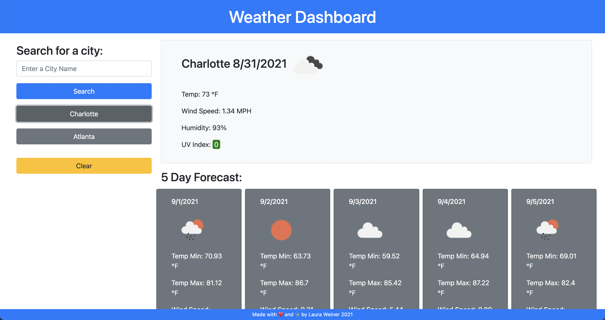

# Weather Dashboard

[Link to finished website](https://lweine01.github.io/weather-dashboard/)

## Table of Contents
- [Description](#Description)
- [Screenshots](#Screenshots)
- [Usage](#Usage)
- [Language](#language)

## Description
In this application a user is able to search for a city's forecast. The page will then display the current day's forecast along with the five day forecast. It will also add a button for all recent searches so the user can easily reference them again.

## Screenshots

## Usage
Used to find weather forecast by city.

## Language
HTML, CSS, and Javascript